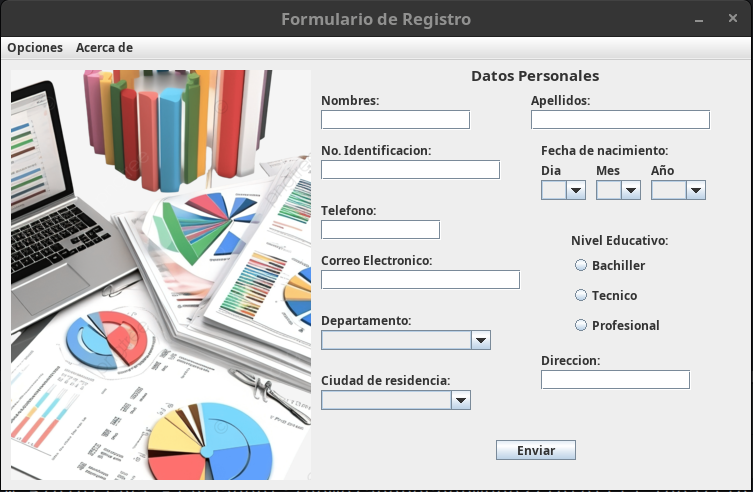
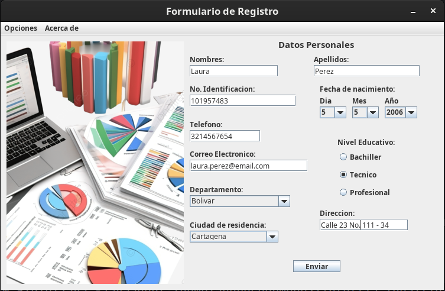
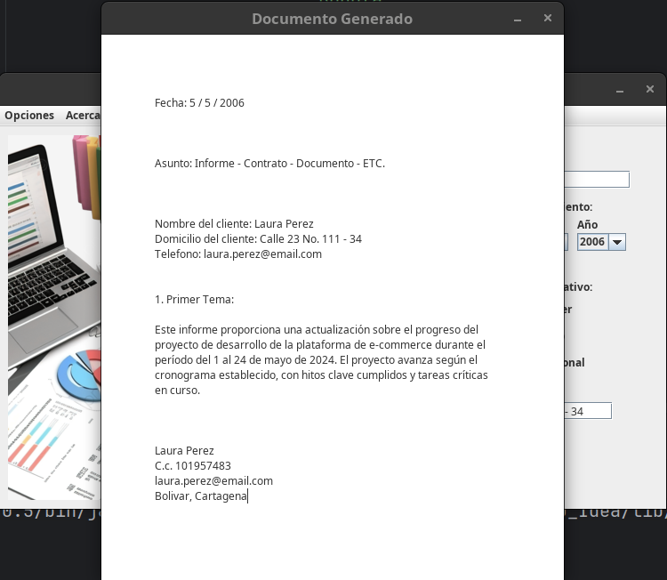

# Formulario

- Formulario de inicio:

Este proyecto es un formulario desarrollado en Java, utilizando
las librerías de componentes de Java Swing para la interfaz gráfica.

El objetivo de este proyecto era fortalecer mi lógica de programación,
aprender a utilizar Java Swing y aplicar los conocimientos adquiridos
en un curso de programación en Java que realicé en YouTube.

- Formulario con datos del usuario:

La logica del proyecto es que mediante la toma de datos por medio
de un formulario se genere automaticamente un documento legal,
con todos los datos proporcionados por el usuario.

- Documento generado:
